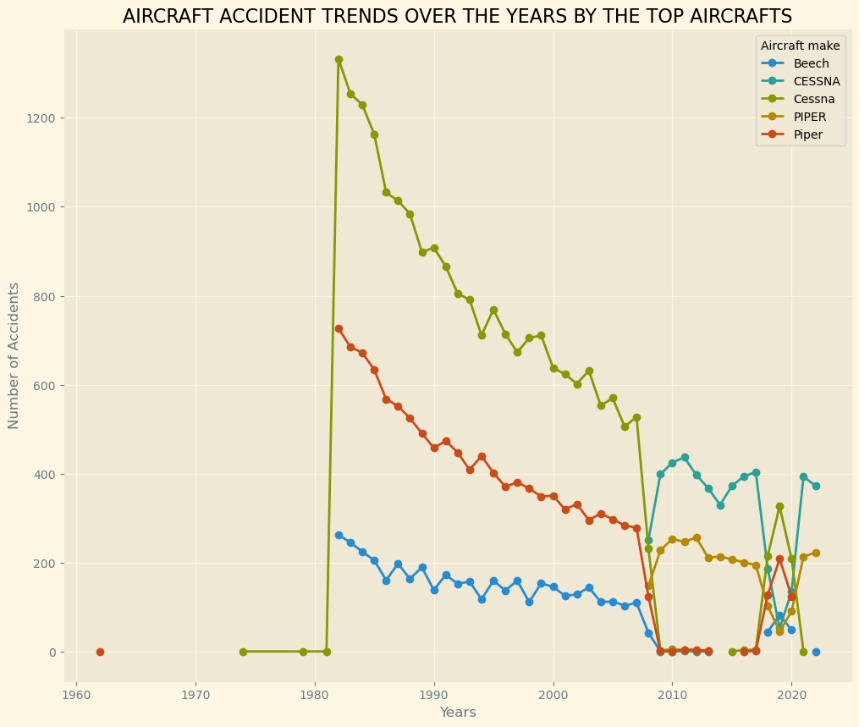
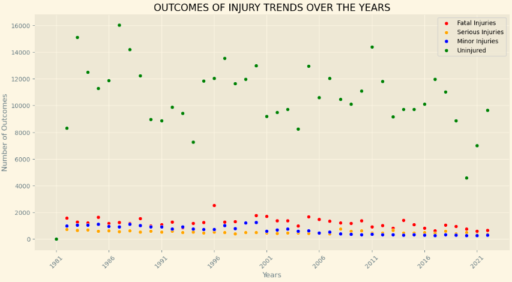
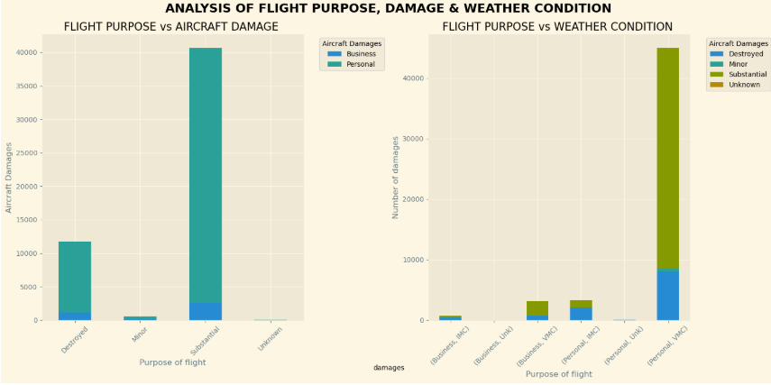

# AVIATION ACCIDENTS TRENDS 

# OVERVIEW
This project analyzes aviation accidents' data from 1980 upto 2022, to study trends of accidents and how it can be used to influence Uzima company's decision in the purchase and operation of aircrafts. Some of the approaches used in this project are borrowed from the [Part 121 Accident Survivability - NTSB](https://www.ntsb.gov/safety/data/Pages/Part121AccidentSurvivability.aspx). I will use data cleaning, imputation, analysis, and visualization to generate insights for the company. 

# BUSINESS PROBLEM
Uzima company can use data from [Aviation Accident Database - Kaggle](https://www.kaggle.com/datasets/khsamaha/aviation-accident-database-synopses/data?select=AviationData.csv) to draw actionable insights on which aircrafts to invest and its potential risks. The purpose of this project is to help determine which airplanes are the lowest risk for the company to start this business endeavour. From the data, I was able to pose the following questions to help make the next steps. 

The business questions posed are:
1. What are the accidents trends over the years?
2. What are the potential risks based on accidents and occupants' survivability?
3. What are the risks based on purpose of flight between commercial and private?
 
 # DATA UNDERSTANDING 
In the data folder is a dataset from the National Transportation Safety Board that includes aviation accident data from 1962 to 2023 about civil aviation accidents and selected incidents in the United States and international waters.
The data we're going to use is contained in the AviationData.csv file; Which has records about the aircraft makes, the accidents' data, injury severity and outcomes etc. that will be used to answer our business questions.

## Data Analysis
###### Time Series analysis:
Plotted a line graph of accidents counts over time to identify trends in aviation accidents.It included comparing accidents trends by aircraft manufacturer to find which aircraft has the lowest risk ove time. 

Injury outcomes counts  were plotted over time, to analyse occupants survivability.

###### Aircraft risks based on flight purpose 
Compared the private to the commercial aircrafts to analyze which one faces lower injury count, damages in accidents and identify  risks related to weather conditions. 

###### Decriptive analysis
Found the count of number of accidents per year and visualized accidents' frequencies in [Tableau](<https://public.tableau.com/views/accidentstrendsdashboard/Accidentstrendsdashboard?:language=en-GB&:sid=&:redirect=auth&:display_count=n&:origin=viz_share_link>)

# RESULTS
Analyses revealed that Beech airlines are the best option to purchase because it has the lowest risk in terms of accident trends. 

Most airline accidents are survivable.
There is a higher count of uninjured passengers compared to other injury outcomes

Commercial aircrafts show lower count of injury outcomes. They also can  withstand weather conditions and sustain damages better than private aircrafts.   

# CONCLUSIONS 
The analysis yielded three recommendations for the company to take:

#### Based on accidents' trends over the years, Beech airlines pose the lowest risk for accidents occurence. 
Although, the other aircrafts show a reduction in accidents rates over the years, Beech has a relatively lower count of accidents compared to the others like Piper and Cessna. It therefore poses the lowest risk for purchase as it has shown better improvements in prevention of accidents measures 

#### Most aircraft accidents are survivable, aviation business is therefore a worthy venture.
The trends over time of occupants survivability based on injury outcomes, show that there is a high record of uninjured survivors compared to minor,serious,or fatally injured survivors. Stricter aviation safety measures and improved aircraft design has contributed to the decline in injury outcomes. 

#### Purchase commercial airlines for operations.
Commercial airlines have shown they can withstand poor weather, sustain damages and have better injury outcomes compared to private airlines.

# NEXT STEPS 
Further analyses could yield better insights to better influence company's decision for purchase of aircraft.

#### Better prediction for survivability data based on  aircraft operating under Code of Federal Regulations (CFR) 
The data on F.A.R Description compared to accidents data such as injury severity. 

#### Show accidents occurence based on broad phase of flight
The model could analyze when accidents most commonly occur; at takeoff, landing or approach.

#### Use data on model of  aircrafts to determine common aircraft used for each category
The data on model of aircraft, can be analyzed based on accidents frequency to determine which is the cost-beneficial to use

#### Accidents severity 
Analyze accidents severity; Investigation type and  aircraft damage to measure how often aircrafts experience damage or severe incidents.     

